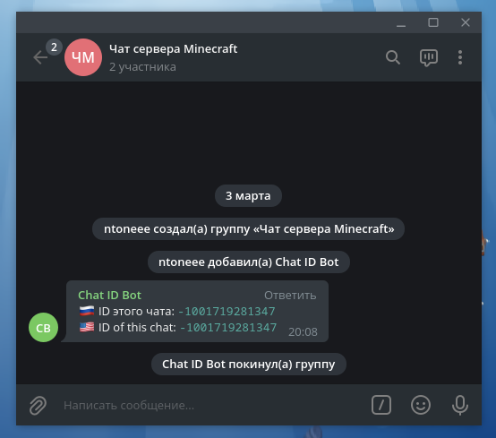
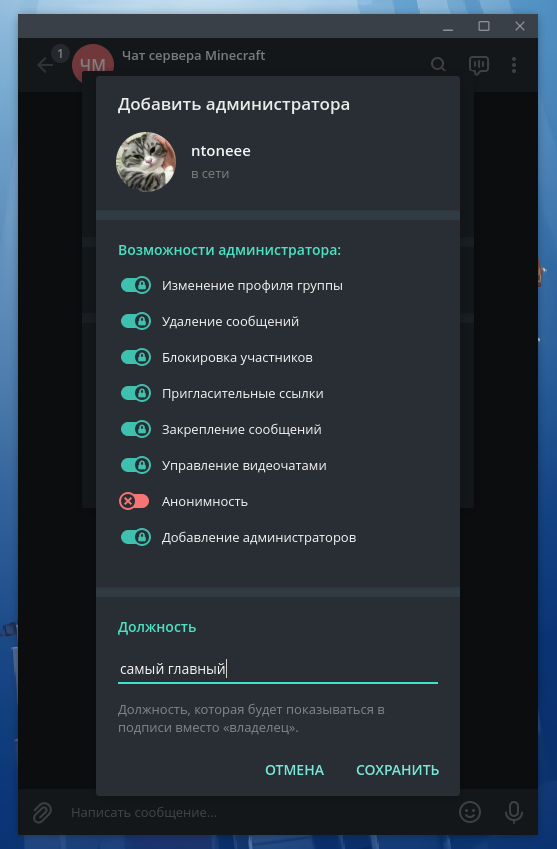
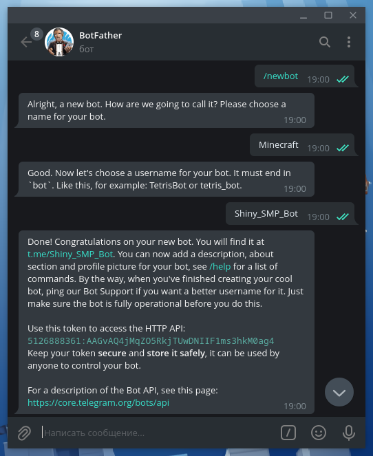
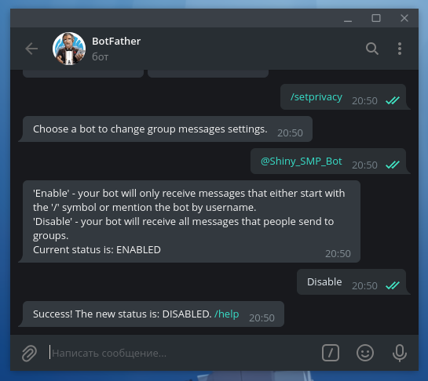
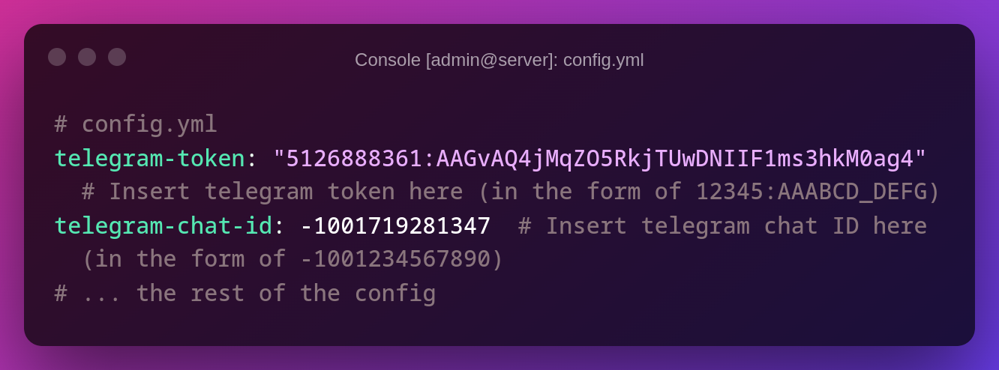
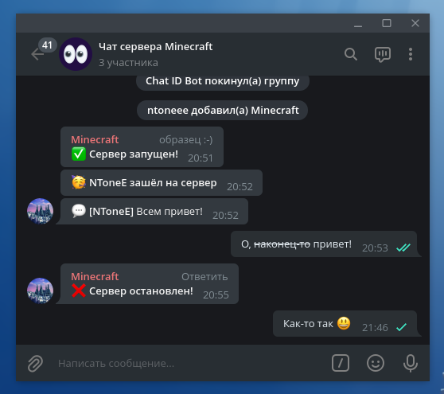
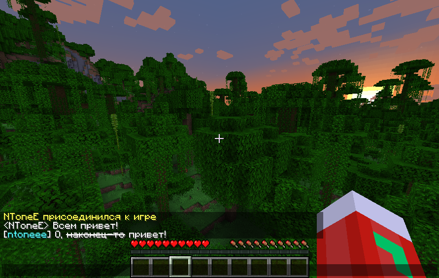
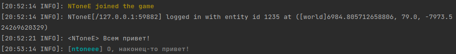

# Первоначальная настройка плагина
## Установка плагина
_Плагин не работает с серверами на Forge, Fabric и официальном ядре Minecraft. Он совместим с серверами, которые поддерживают плагины под Spigot, например, Spigot, Paper или Purpur._

Плагин — файл `minecraft-telegram-bridge-{версия}-all.jar` — нужно положить в папку `plugins/` вашего сервера. Для того, чтобы появились шаблоны файлов `config.yml` и `lang.yml` (в директории `Minecraft-Telegram_Bridge`), необходимо запустить сервер с плагином хотя бы один раз.

Для того, чтобы бот работал с настройками по умолчанию, необходимо будет исправить два значения — ID чата в Telegram и токен бота. Обо всём по порядку:

## Чат в Telegram
### Получаем ID чата
При настройке нужен ID чата в Telegram, куда и откуда бот будет слать сообщения.
Его можно узнать, например, добавив в группу [@chat_id_nbot](https://t.me/chat_id_nbot). Этот бот сообщит ID группы и сразу же её покинет.

### Необходима *супер*группа
Если ID группы **не начинается** на `-100`, то необходимо сделать её супергруппой. Для этого можно, например, выдать себе **должность** в группе:

> ID группы меняется при преобразовании в супергруппу, поэтому при случайном преобразовании плагин перестанет работать. В частности, из-за этого необходимо заново узнать ID чата (повторить действия из предыдущего пункта)

## Создание бота
Для работы плагина нужен токен Telegram-бота — чтобы сообщения из Minecraft пересылались в Telegram под отдельным аккаунтом. Если у вас нет лишнего бота, его надо создать.

Как создать бота в Telegram?

 
В Telegram для создания ботов есть бот — [@BotFather](https://t.me/botfather).
Для создания бота надо написать ему `/newbot` и следовать инструкциям:

Токен (строка вида `5126888361:AAGvAQ4jMqZO5RkjTUwDNIIF1ms3hkM0ag4`) нам понадобится для настройки бота. Эту строку
важно держать в секрете, с её помощью можно, например, слать неожиданные 
сообщения от имени бота. _А токен своего бота я уже сменил на другой при помощи команды `/revoke` :)_

Теперь у вас есть токен бота! 

### Настройка бота
Для того, чтобы плагин работал (мог видеть все сообщения игроков в Telegram), нужно включить соответствующую настройку в [@BotFather](https://t.me/botfather).
А именно, необходимо **выключить** "режим приватности" — прописать команду `/privacy`, выбрать созданного бота и нажать `Disable`:

Можно добавлять бота в чат! Остается последний штрих:

## Заполняем `config.yml`
Вставляем токен бота к `telegram-token`, а ID чата к `telegram-chat-id`.

Должно получиться примерно так (разумеется, с другим токеном и ID чата):

Обратите внимание на кавычки вокруг токена бота и их отсутствие вокруг ID чата!

## Вуаля:

Если вы сделали все правильно, то получите что-то такое:

В консоли сообщения из Telegram тоже будут выделяться:

